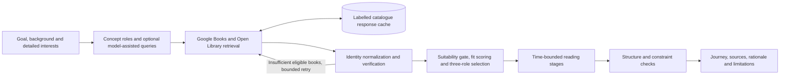
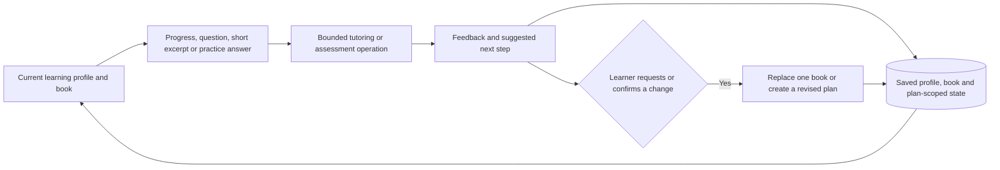

# Atlas architecture

Atlas is a local Streamlit proof of concept with a **bounded, explicitly programmed agent workflow**. It combines model-assisted interpretation and assessment with catalogue tools, deterministic validation, user-approved actions and persistent state. It is not an open-ended autonomous research or reflection system.

## Recommendation workflow

`src/graph.py` implements these fixed nodes in LangGraph. The configured search-pass limit is at most three. The first pass queries catalogues; subsequent passes can supplement with explicitly permitted cached fixtures. This retry branch is **not** a model independently inventing new tools, continuously revising its search strategy or proving that the selected books are optimal. When requirements are not met, the application exposes the shortfall.

Domain services in `src/services/` implement identity matching, detailed-interest handling, scoring, selection and time estimates. The live mode can use Bedrock to plan concise catalogue queries and assess suitability from returned metadata. Book identity comes from external catalogue records, not model-invented citations. A verified identity does not establish that a book teaches every requested subfield or that its contents are accurate.

## Learning workflow

- The study coach handles time, motivation and cross-book questions. A book's own conversation handles that book and a possible single-book replacement.
- Practice uses one single-choice item, one true/false item and one short answer. Objective answers are checked against the question's key; written reasoning needs the model. Empty answers are not treated as mistakes. The generated key itself can be wrong, so checking a selection is not a guarantee of subject-matter correctness.
- Online question generation uses editorial checks, independent solving and bounded repair. Failed validation falls back to clearly labelled foundational practice, which may not address a narrow requested subfield.
- Excerpt support uses the passage supplied by the learner and distinguishes it from general explanation. Atlas does not possess or claim to have read the full book.
- Plan changes remain explicit learner actions. Local reminders and reading-session follow-up operate while the application is available; there is no always-on background tutor or closed-app notification service.

## State and boundaries

`src/database.py` stores profiles, goals, reading plans, progress, conversations and settings in SQLite. Language, book/context and plan-version keys prevent routine UI state from being attached to the wrong learning context. These are **application organization boundaries, not authenticated security boundaries**: a profile ID is not a password, and this prototype is not suitable for storing private multi-user data on an unprotected public server.

`src/llm/` isolates Bedrock behind typed provider interfaces with bounded timeouts and retries. Live calls send relevant goals, background, catalogue metadata, learner questions or excerpts to the configured provider. Model-dependent privacy terms apply. Aggregate call/token telemetry is separate from learning outcomes and is not a security certification.

## Verification

- `scripts/preflight.py`: local lint, tests, compilation, secret-pattern checks and deterministic evaluation. Use a report generated for the delivered source, not an older green report.
- `python -m scripts.run_live_evaluation --confirm-live-cost`: optional, billable catalogue/Bedrock smoke test using the operator's credentials.
- `docs/qa-learning-focus-mixed-practice-2026-09-05.md`: dated checks and remaining mixed-practice quality limitations.
- `docs/human_evaluation_protocol.md`: proposed external evaluation; its existence does not mean a human study has been completed.
